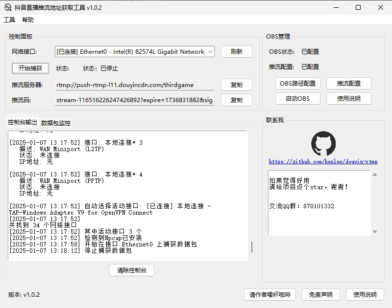

# 抖音直播推流地址获取工具

一款基于python3.12开发、Npcap进行网络抓包的抖音直播推流地址获取工具
获取到推流地址后，可以通过obs等直播工具进行抖音直播

## 界面展示

### 使用界面




## 使用说明

### 视频教程
https://www.bilibili.com/video/BV1XFrjYGEQ4

### 使用环境
Windows 10 及以上版本，低版本Windows未进行验证过，也许可行？
需关闭杀毒软件或加入白名单

### 使用说明

1. 本工具使用了网络抓包技术，可能会被杀毒软件误报，在下载时请关闭所有的杀毒软件或将本软件加入到白名单中，如360、腾讯管家、火绒、windows defender等;
2.  下载方式
    1.  在[Releases](https://github.com/heplex/douyin-rtmp/releases)页面选择喜欢的版本，点击douyin-rtmp.exe进行下载；
    2.  直接点击下载[douyin-rtmp.exe](https://github.com/heplex/douyin-rtmp/releases/latest/download/douyin-rtmp.exe)
    3.  国内用户代理下载地址[https://gh-proxy.com/github.com/heplex/douyin-rtmp/releases/latest/download/douyin-rtmp.exe](https://gh-proxy.com/github.com/heplex/douyin-rtmp/releases/latest/download/douyin-rtmp.exe)
3. 下载完成后，使用管理员权限进行运行；
4. 在弹出的免责声明对话框中，点击“确定”按钮，继续使用则表示您同意以上条款；
5. 如果未检测到Npcap，会提示先安装Npcap，安装完成后，重新启动软件；
6. 选择对应的网络接口，有线网卡优先，如果未检测到，请手动选择；
7. 点击“开始捕获”按钮，开始捕获抖音直播推流地址；
8. 打开直播伴侣进行开播，推流地址会自动获取，并显示在软件中；
9.  如果推流地址获取失败，请检查网络接口是否选择正确，以及直播伴侣是否正常开播；
10. 如果仍然失败，可以尝试在工具重新安装Npcap，并重新启动软件；
11. 在OBS管理面板中配置好相关参数后，自动同步推流地址至OBS,一键开播！

### 卸载

1. 在工具选项下，点击卸载Npcap，卸载完成后，删除本软件即可；

### 交流群

QQ群：870101332


## 免责说明

1. 本工具仅供学习和研究使
2. 请勿用于任何商业用途
3. 使用本工具产生的一切后果由使用者自行承担
4. 本工具使用了网络抓包技术，可能会被杀毒软件误报
   这是因为抓包功能与某些恶意软件行为类似，请放心使用

## 更新日志

1. 2025.01.06 v1.0.0 
   1. 更新获取推流地址以及推流功能
2. 2025.01.06 v1.0.1 
   1. 重构代码，调整项目结构
   2. 优化界面操作逻辑以及界面布局
   3. 优化抓包匹配正则
   4. 增加更新检测
   5. 优化Npcap安装
3. 2025.01.07 v1.0.2
   1. 增加OBS自动更新配置
   2. 去掉免责弹窗，增加用户体验
   3. 优化界面布局 
4. 2025.01.10 v1.0.3
   1. 修复了推流码获取失败的问题
   2. 调整更新信息


## 开发指南

### 目录结构
```
project
├── main.py                # 主入口
├── resources
│   └── npcap-1.80.exe    # Npcap安装程序
├── core
│   ├── capture.py        # 数据包捕获
│   └── npcap.py          # Npcap管理
├── gui
│   ├── main_window.py    # 主窗口
│   └── widgets.py        # GUI组件
└── utils
    ├── logger.py         # 日志管理
    ├── network.py        # 网络接口
    └── system.py         # 系统工具
```

### 项目启动

**1.对于Windows11 24H2以下的系统，以管理员身份运行cmd并执行以下命令**

```
pip install -r requirements.txt
python main.py
```

**2.对于Windows11 24H2及以上的系统，以任意身份运行cmd并执行以下命令**

```
pip install -r requirements.txt
sudo python main.py
```

### 打包命令

发行版默认采用Pyinstaller进行打包

**1.Pyinstaller**

- 优势：打包时间短
- 缺点：运行效率较低
- 原理：将Python环境与项目整合打包，使其能够在没有部署Python环境的设备上运行

```
build.bat -y
```

**2.Nuitka**

- 优势：运行效率高，相当于原生C语言程序
- 缺点：打包时间极长，可能存在环境问题导致打包失败
- 原理：将Python代码转换为C代码并使用MinGW64进行编译、静态链接，使其能够真正脱离Python环境运行

```
build.bat -y nuitka
```

## 请作者喝杯咖啡？

多少都是心意，一分也是对我莫大的鼓励！谢谢您的支持！


## Star History

<a href="https://star-history.com/#heplex/douyin-rtmp&Date">
 <picture>
   <source media="(prefers-color-scheme: dark)" srcset="https://api.star-history.com/svg?repos=heplex/douyin-rtmp&type=Date&theme=dark" />
   <source media="(prefers-color-scheme: light)" srcset="https://api.star-history.com/svg?repos=heplex/douyin-rtmp&type=Date" />
   
 </picture>
</a>

